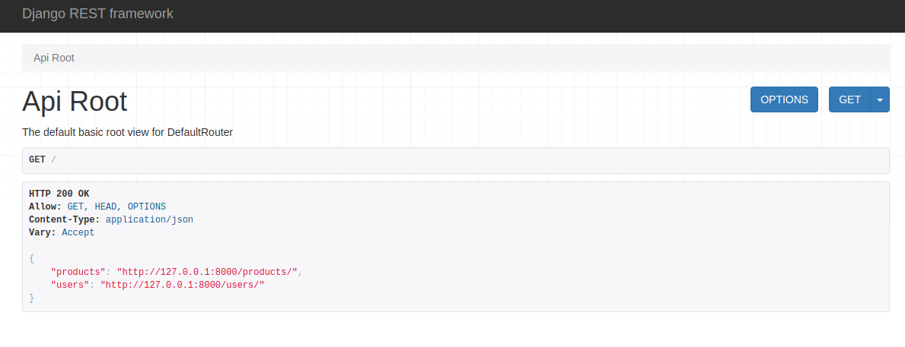

# donations
PI  Univesp - Donations

# Iniciar
- Fazer clone do projeto
- Criar uma virtual env para gerenciar os pacotes (libs)
    - `python3 -m venv venv`
    - `source venv/bin/activate`
- Instalar pacotes
    - `pip install -r requirements.txt`
- Criar migrations (banco de dados)
    - `python manage.py makemigrations`
    - `python manage.py migrate`
- Rodar projeto
    - `python manage.py runserver`
- Acessar o host
    - http://127.0.0.1:8000/



# Como usar?

Temos 2 endpoints que seguem as regras dos verboa HTTP.
    - POST (create)
    - PUT (update)
    - GET (view)
    - DELETE (delete)

```json
{
    "products": "http://127.0.0.1:8000/products/",
    "users": "http://127.0.0.1:8000/users/"
}
```